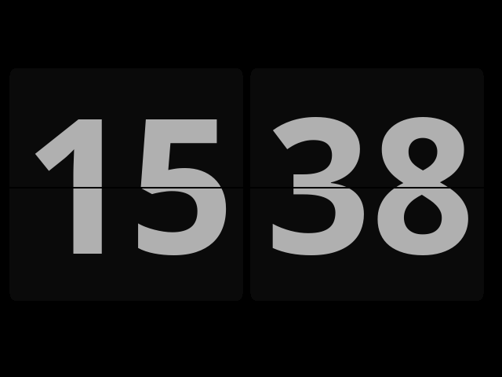

# Now Open Fliqlo

# Whats that?
It's Open Source port of Fliqlo screensaver for Windows and OSX platforms.
Uses SDL libraries to draw to screen.
No idea who uses screensavers these days, but still was fun to write it.

## What's that?
It's Open Source implementation of Fliqlo screensaver that's available for Windows and OSX platforms.
It uses SDL libraries to draw. 
Ever seen a flip clock? No. Google one out. Freaky technology.

# Changelog
## 2.0
* Code was cleaned up
* Moved away from using a bitmap onto drawing with primitives to draw a background. Still needs aliasing for jagged corners;
* Custom width, height, Truetype font now supported.

# BUILD
Compile with:

	make
	
# LICENSE

This code is published under a MIT license
